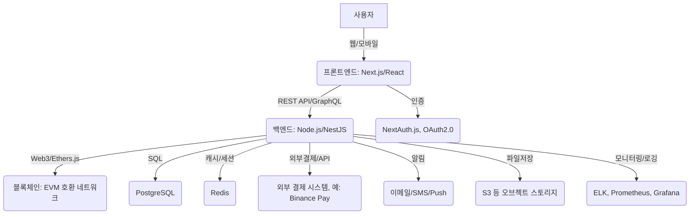
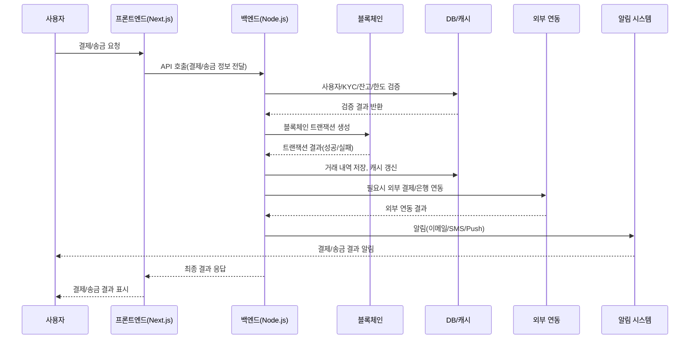

# 원화 기반 스테이블 코인 결제 웹앱 시스템 설계 개요

---

## 1. 전체 아키텍처 다이어그램 및 주요 흐름 설명

### 주요 흐름 설명

- **사용자 → 프론트엔드**: 사용자는 웹/모바일 앱을 통해 서비스에 접근합니다.
- **프론트엔드 → 백엔드**: Next.js/React 기반 프론트엔드는 REST API 또는 GraphQL을 통해 백엔드와 통신합니다.
- **백엔드 → 블록체인**: 결제, 송금, 자산 이동 등 주요 트랜잭션은 Web3/Ethers.js를 통해 EVM 호환 블록체인 네트워크에 기록됩니다.
- **백엔드 → DB/캐시**: 사용자, 거래, 정산 등 데이터는 PostgreSQL에 저장되고, 세션/임시 데이터는 Redis에 캐싱됩니다.
- **백엔드 → 외부 연동**: 외부 결제 시스템(Binance Pay 등), 알림(이메일/SMS/Push), 파일저장(S3), 모니터링/로깅(ELK, Prometheus, Grafana) 등 다양한 외부 서비스와 연동됩니다.
- **프론트엔드 → 인증**: NextAuth.js, OAuth2.0 등으로 사용자 인증 및 소셜 로그인을 처리합니다.

---

## 2. 주요 컴포넌트별 역할 정의

| 컴포넌트    | 주요 책임 및 기능                                                                 |
| ----------- | --------------------------------------------------------------------------------- |
| 프론트엔드  | 사용자 대시보드, 결제/송금 UI, 지갑 관리, 거래 내역, 알림, 인증/로그인, 반응형 UI |
| 백엔드      | REST API/GraphQL 제공, 결제/송금/입출금/지갑/관리자 서비스, 외부 연동, 보안/로깅  |
| 블록체인    | 스테이블 코인 스마트컨트랙트, 온체인 자산 이동, 거래 내역 투명성, 보안성 강화     |
| DB/캐시     | PostgreSQL(사용자/거래/정산 데이터), Redis(세션/임시 데이터 캐시)                 |
| 인프라/운영 | AWS 클라우드, Docker, Nginx, S3, CloudFront, CI/CD, 모니터링/로깅                 |
| 외부 연동   | 결제 게이트웨이, 은행/오픈뱅킹, 인증/알림/챗봇, 회계/통계 등 외부 시스템 연동     |

---

## 3. 데이터 흐름 시나리오

### 결제/송금 프로세스 시퀀스 다이어그램

#### 설명

- 사용자가 결제/송금 요청을 하면 프론트엔드가 백엔드 API를 호출합니다.
- 백엔드는 DB/캐시에서 사용자 정보, KYC, 잔고, 한도 등을 검증합니다.
- 검증이 통과되면 블록체인 트랜잭션을 생성하고, 결과를 받아 거래 내역을 저장합니다.
- 필요시 외부 결제 시스템이나 은행 API와 연동하여 추가 처리를 합니다.
- 모든 과정이 끝나면 알림 시스템을 통해 사용자에게 결과를 안내합니다.
- 프론트엔드는 최종 결과를 사용자에게 표시합니다.

---

## 4. 보안 및 확장성 정책

| 항목          | 적용 내용 및 정책 설명                                                         |
| ------------- | ------------------------------------------------------------------------------ |
| TLS 1.3       | 모든 API 및 데이터 전송 구간 암호화, 인증서 자동 갱신(Certbot 등) 적용         |
| OAuth2.0      | 소셜 로그인, 외부 서비스 연동, API 인증에 표준 프로토콜 적용                   |
| 2FA           | 고액 결제, 민감 기능 접근 시 이중 인증(OTP, SMS 등) 적용                       |
| KYC/AML       | 회원가입 및 주요 거래 시 신분증 인증, 실명 확인, 자금세탁방지 외부 서비스 연동 |
| Helmet        | HTTP 보안 헤더 적용, XSS/Clickjacking 등 기본 방어                             |
| rate-limiter  | API abuse 방지, 사용자별/엔드포인트별 요청 제한                                |
| AWS WAF       | 웹 방화벽, 공격 패턴 차단, IP/Geo 기반 접근 제어                               |
| 오토스케일링  | 트래픽 증가 시 자동 인스턴스 확장, 무중단 배포 지원                            |
| 모니터링/로깅 | Prometheus, Grafana, ELK 등으로 실시간 모니터링 및 이상 탐지                   |

### 설명

- **TLS 1.3**: 모든 네트워크 구간에서 최신 암호화 프로토콜을 적용하여 데이터 유출을 방지합니다.
- **OAuth2.0**: 인증 및 권한 부여를 표준화하여, 외부 서비스 연동 및 보안성을 강화합니다.
- **2FA**: 사용자 계정 및 자산 보호를 위해 이중 인증을 필수화합니다.
- **KYC/AML**: 금융 규제 준수를 위해 신원 확인 및 자금세탁방지 절차를 도입합니다.
- **Helmet, rate-limiter**: 기본적인 웹 보안 및 서비스 남용 방지 기능을 미들웨어로 적용합니다.
- **AWS WAF, 오토스케일링**: 인프라 차원에서 공격 방어와 확장성을 동시에 확보합니다.
- **모니터링/로깅**: 실시간 이상 탐지 및 장애 대응을 위한 체계적인 모니터링 환경을 구축합니다.

---

## 5. 결론

이 설계는 금융/결제 서비스에 요구되는 보안, 확장성, 신뢰성을 모두 충족하며, 최신 웹/블록체인 기술을 활용해 빠른 개발과 운영이 가능합니다. 각 컴포넌트는 독립적으로 확장 및 교체가 용이하도록 설계되었습니다.

---

## 6. 추후 연동 기능(External Integration)

### 6.1 결제/송금 관련 외부 연동

- 외부 결제 시스템(Binance Pay, Toss, 카카오페이, 네이버페이 등) 연동
- 신용카드/체크카드 결제 연동(가상/실물 카드 발급 시 필요)
- PG사(Payment Gateway) 연동(온라인/오프라인 가맹점 결제 지원)

### 6.2 금융/자금 관련 외부 연동

- 은행 API(원화 입출금, 실시간 계좌 인증, 예치금 관리 등)
- 오픈뱅킹(Open Banking) API 활용
- 환율 정보 제공 API(실시간 환율 정보)

### 6.3 블록체인/암호화폐 관련 외부 연동

- 외부 지갑(메타마스크, Kaikas, 클립 등) 연동
- 블록체인 익스플로러(거래 내역, 트랜잭션 상태 실시간 조회)

### 6.4 사용자 인증/보안 관련 외부 연동

- SMS/이메일 인증 서비스(Twilio, AWS SNS, 카카오 알림톡 등)
- 소셜 로그인(Google, Kakao, Naver, Apple 등)
- KYC/AML 인증 서비스(신분증 인증, 실명 인증, 자금세탁방지 외부 서비스)

### 6.5 알림/마케팅/운영 관련 외부 연동

- 푸시 알림 서비스(Firebase Cloud Messaging, OneSignal 등)
- 이메일 발송 서비스(SendGrid, Mailgun, Amazon SES 등)
- 고객센터/챗봇(Zendesk, Intercom, Kakao 챗봇 등)

### 6.6 기타 연동

- 회계/정산 시스템(ERP, 회계 소프트웨어 등)
- 통계/모니터링(Google Analytics, Sentry, Datadog 등)

---

> 위 연동 기능들은 서비스 확장 및 운영 효율성, 사용자 편의성 강화를 위해 단계적으로 도입할 수 있습니다.
